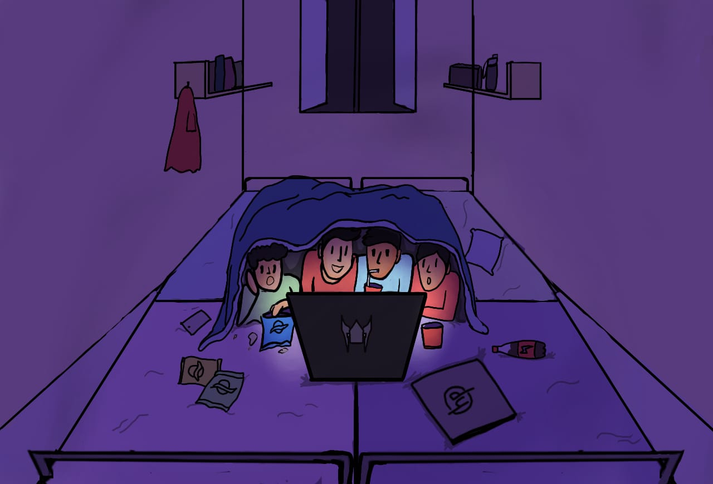

See tutorial.md for detailed explanation of sprite animation.

## Adding a room 

Adding a submission as a room, add the image in "canvas-viewport" div



and arrange its position using css

```css
#subm-1{

    position: absolute;
    top:177px; right:0px;
    width:600px;
    height:400px;

}
```

## Adding sprites

Add the spritesheet in /img directory.

create a variable in js/app.js as

```js
var cat = {
    pos: [2171,412],
    sprite: new Sprite('img/catlick.png', [0, 0], [32, 16],4,[0,1,2,3]),
}
```

Sprite takes in arguments:
arg0 : path to image
arg1: start point at the sprite-sheet (usually [0,0])
arg2: size of each frame ([width,height])
arg3: speed of animation (frames/sec)
arg4: frames order

add the following in  the function updateEntities() 

```js
cat.sprite.update(dt)
```

 it just tells to update the frame index each time.

and finally add `renderEntity(cat)` in the render() function.
so that the sprite is rendered on the canvas.

Note: Makesure to place renderPlayer() at the bottomost of the render() function.